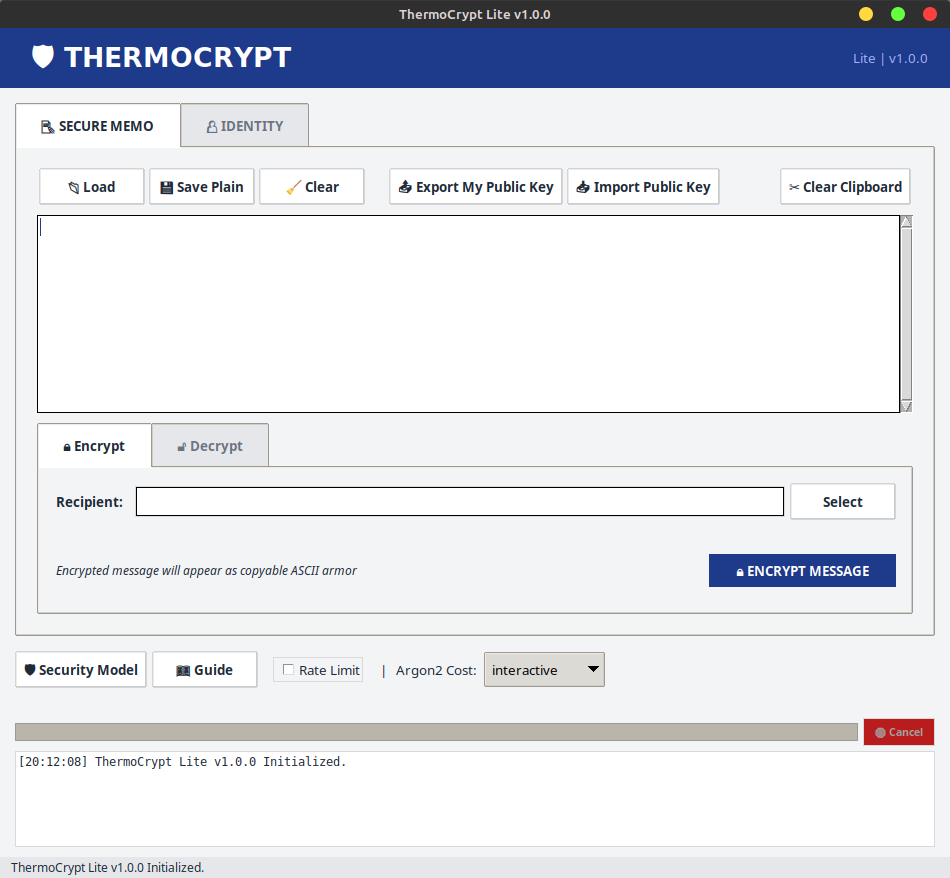

# ThermoCrypt Lite: PGP-Inspired Post-Quantum Text Encryption


## Abstract

**ThermoCrypt Lite** is a text-only encryption tool inspired by PGP, designed for the post-quantum era. It provides strong confidentiality guarantees against both classical and quantum adversaries through a hybrid cryptographic approach.

The system integrates **ML-KEM-768 (Kyber)** -- a Module-Lattice-based Key Encapsulation Mechanism selected by NIST -- combined with **X25519** (Elliptic Curve Diffie-Hellman). This hybrid approach ensures that confidentiality is preserved even if one of the underlying mathematical problems is solved. Identity verification uses **ML-DSA-65 (Dilithium)** and key derivation employs **Argon2id**.

> **PROJECT STATUS:** This repository is published as a static research artifact (v1.0.0). It serves as a reference implementation for Hybrid PQC combined with Hardware Binding logic.

## Features

* **📝 Secure Memo:** Encrypt/Decrypt text directly in RAM without writing plaintext to disk.
* **🛡️ ASCII Armor:** Outputs PGP-compatible text blocks (`-----BEGIN THERMO MESSAGE-----`).
* **🔐 Hardware Binding:** Bind identities to a specific machine's TPM 2.0 chip (Linux only) to prevent key theft.
* **⚡ Zero-Copy Architecture:** Sensitive data is streamed directly from locked memory to the encryption engine.
* **🔑 Identity Management:** Full Public/Private key management with exportable public keys.
  > **NOTE:** The alias you assign during import becomes the local filename (e.g., `keys/bob.thermoid`). You must use this **local alias** when encrypting messages, regardless of what the original sender named their identity.

## Architecture & Security

| Component | Implementation | Notes |
| :--- | :--- | :--- |
| **KEM (Hybrid)** | Kyber-768 + X25519 | FIPS 203 + RFC 7748 |
| **Signatures** | Dilithium-65 | FIPS 204 (Anti-Spoofing) |
| **Symmetric** | XChaCha20-Poly1305 | Authenticated Encryption |
| **KDF** | Argon2id v1.3 | Resistance against GPU cracking |
| **Memory** | `sodium_mlock` | Prevents RAM swapping to disk |

## Interface

The project includes a Python-based GUI for ease of use, wrapping the secure C++ core.



## Supported Platforms

| Platform | Disk Mode | TPM Mode | Status |
|----------|-----------|----------|--------|
| **Linux (x86_64)** | ✅ | ✅ | Fully Supported |
| **Windows (x64)** | ✅ | ❌ | Disk Mode Only |

### Binding Modes

- **Disk Mode (Default):** Keys protected with Argon2id, portable across machines
- **TPM Mode (Linux):** Keys bound to TPM 2.0 chip, cannot be extracted or used elsewhere

## Cryptographic Primitives

| Component | Algorithm | Standard | Security Level |
|-----------|-----------|----------|----------------|
| **Post-Quantum KEM** | ML-KEM-768 (Kyber) | NIST FIPS 203 | Level 3 |
| **Classical KEM** | X25519 | RFC 7748 | 128-bit |
| **Signature Scheme** | ML-DSA-65 (Dilithium) | NIST FIPS 204 | Level 3 |
| **Symmetric Encryption** | XChaCha20-Poly1305 | libsodium | 256-bit |
| **Key Derivation** | Argon2id | RFC 9106 | Configurable |
| **Hardware Binding** | RSA-OAEP-2048 | TPM 2.0 Spec | — |

## Build Instructions

### Prerequisites

- **Compiler:** C++17 compliant (`g++` ≥ 7 or `clang++` ≥ 5)
- **Libraries:** `libsodium`, `liboqs`
- **Linux TPM:** `tpm2-tss` (libtss2-esys, libtss2-mu, libtss2-tctildr)
- **GUI:** Python 3.8+ with Tkinter

### Linux (Debian/Ubuntu)

```bash
# 1. Install dependencies
sudo apt install build-essential libsodium-dev libssl-dev

# For TPM support:
sudo apt install libtss2-dev

# 2. Build liboqs (if not packaged)
git clone https://github.com/open-quantum-safe/liboqs.git
cd liboqs && mkdir build && cd build
cmake -DCMAKE_INSTALL_PREFIX=/usr/local ..
make -j$(nproc) && sudo make install

# 3. Compile ThermoCrypt Lite (without TPM)
g++ -o thermo_core thermo_core.cpp \
    -std=c++17 -O2 \
    -Wall -Wextra \
    -fstack-protector-strong \
    -fPIE -pie \
    -D_FORTIFY_SOURCE=2 \
    /usr/local/lib/liboqs.a -lsodium -lpthread

# 3b. Compile with TPM support
g++ -o thermo_core thermo_core.cpp \
    -std=c++17 -O2 \
    -DENABLE_TPM \
    -Wall -Wextra \
    -fstack-protector-strong \
    /usr/local/lib/liboqs.a -lsodium -lpthread \
    -ltss2-esys -ltss2-mu -ltss2-tctildr
```

### Windows (MinGW64 / MSYS2)

```bash
# Compile (Disk mode only)
g++ -o thermo_core.exe thermo_core.cpp \
    -std=c++17 -O2 \
    -static \
    -lsodium -loqs -lws2_32
```

## Usage

### GUI

```bash
python3 thermo_gui.py
```

### CLI Reference

#### Identity Management

```bash
# Generate new identity (interactive password prompt)
./thermo_core --gen alice

# Generate TPM-bound identity (Linux, requires root)
sudo ./thermo_core --gen alice --bind tpm

# Generate in specific TPM slot (0-255)
sudo ./thermo_core --gen bob --bind tpm --tpm-slot 1
```

#### Message Encryption (ASCII Armor)

```bash
# Encrypt message to recipient
echo "Secret message" | ./thermo_core --encrypt-armor recipient.thermoid

# Encrypt from file
cat message.txt | ./thermo_core --encrypt-armor recipient.thermoid > encrypted.txt

# Result: ASCII-armored ciphertext
# -----BEGIN THERMO MESSAGE-----
# base64-encoded-ciphertext...
# -----END THERMO MESSAGE-----
```

#### Message Decryption

```bash
# Decrypt (interactive password prompt)
cat encrypted.txt | ./thermo_core --decrypt-armor alice

# Decrypt TPM-bound message (requires root)
cat encrypted.txt | sudo ./thermo_core --decrypt-armor alice
```

#### Public Key Management

```bash
# Export your public key (share with others)
./thermo_core --export-pubkey alice > alice_public.thermoid

# Import someone's public key
cat bob_public.thermoid | ./thermo_core --import-pubkey bob
```

### Options

| Option | Description |
|--------|-------------|
| `--bind <disk\|tpm>` | Hardware binding mode (default: disk) |
| `--tpm-slot <0-255>` | TPM handle slot for multiple identities |
| `--argon-level <level>` | Key derivation strength: `interactive`, `moderate`, `sensitive` |
| `--keydir <path>` | Custom key storage directory |
| `--rate-limit` | Enable brute-force protection delay |

### TPM Management (Linux)

```bash
# List persistent TPM handles
tpm2_getcap handles-persistent

# Clear identity from slot 0 (handle 0x81018100)
sudo tpm2_evictcontrol -C o -c 0x81018100

# Clear identity from slot 1 (handle 0x81018101)
sudo tpm2_evictcontrol -C o -c 0x81018101
```

## Security Features

### Memory Protection

- **SecretString:** Custom string class using `sodium_malloc` — no SSO leakage
- **SecureByteVec:** Vector with `SodiumAllocator` — auto-wipe on destruction
- **SecureVectorStream:** Zero-copy streaming — plaintext never leaves locked memory
- **mlock:** Entire process locked to RAM (prevents swap exposure)
- **Guard pages:** Buffer overflow detection

### File System Protection

- **O_NOFOLLOW:** Atomic symlink rejection (Linux)
- **fstat on FD:** TOCTOU-safe file verification
- **Path blocklists:** Protected system directories

### Side-Channel Mitigation

- **Constant-time comparison:** `sodium_memcmp` for all secret comparisons
- **Timing-consistent verification:** All checks performed before any errors
- **Rate limiting:** Configurable delay on authentication failures
- **Core dump prevention:** `RLIMIT_CORE = 0`
- **Debugger prevention:** `ptrace` self-attachment

## Project Structure

```
thermocrypt-lite/
├── thermo_core.cpp    # C++ cryptographic core
├── thermo_gui.py      # Python GUI wrapper
├── README.md          # This file
├── SECURITY.md        # Security policy and recommendations
├── LICENSE            # MIT License
└── keys/              # Default key storage (created at runtime)
```

## License

This project is licensed under the **MIT License**. See [LICENSE](LICENSE) for details.

## Acknowledgments

- [libsodium](https://libsodium.org/) — Cryptographic primitives
- [liboqs](https://openquantumsafe.org/) — Post-quantum algorithms
- [NIST PQC](https://csrc.nist.gov/projects/post-quantum-cryptography) — Algorithm standardization

---

*ThermoCrypt Lite v1.0.0 — Quantum-Resistant Text Encryption*
